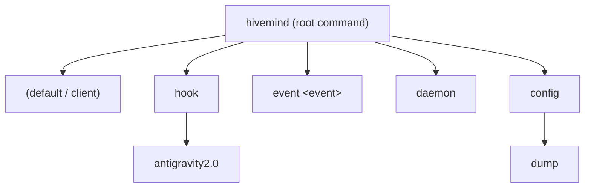

# Command Line Interface (CLI) Specification

This document details the command hierarchy, option flags, subcommands, and integration structures for the **hivemind** command-line interface.

---

## 1. Subcommand Structure

The `hivemind` executable organizes its capabilities into a hierarchical tree of subcommands using `treecli`.



### Subcommands Table

| Subcommand | Description | Arguments / Options |
| :--- | :--- | :--- |
| **`(default)`** | Launches the TUI swarm dashboard. Auto-spawns the daemon if it is not running. | `[-demo]` `[-restart]` |
| **`daemon`** | Starts the state ingestion server in the foreground. | None |
| **`hook antigravity2.0`** | Installs process-based telemetry hooks into the active workspace. | None |
| **`event <event>`** | Standard input parser that forwards telemetry event packets to `hivemindd`. | `<event_name>` (e.g. `PreToolUse`) |
| **`config dump`** | Dumps the active configuration JSON to the console. | None |

---

## 2. Command Details & Usage

### 2.1. Swarm Dashboard Client (Default)
When executed without any recognized subcommand, `hivemind` starts the Bubble Tea terminal dashboard client.

```bash
# Start the live dashboard client (spawns daemon in background if needed)
hivemind

# Start the client in offline interactive mock/demo mode
hivemind -demo
```

---

### 2.2. Swarm Telemetry Daemon (`daemon`)
Launches the background ingestion server which opens a Unix Domain Socket (UDS) listener to aggregate swarming state updates.

```bash
hivemind daemon
```

---

### 2.3. Active Telemetry Installer (`hook antigravity2.0`)
Generates the `.agents/hooks.json` configuration file in the active workspace. This configures Antigravity 2.0 to trigger `hivemind event <event>` at relevant execution hooks.

```bash
# Executed in your active workspace directory
hivemind hook antigravity2.0
```

#### Generated Workspace File (`.agents/hooks.json`):
```json
{
  "debug-hooks": {
    "PreToolUse": [
      {
        "matcher": "*",
        "hooks": [
          {
            "command": "/absolute/path/to/hivemind event PreToolUse"
          }
        ]
      }
    ],
    "PostToolUse": [
      {
        "matcher": "*",
        "hooks": [
          {
            "command": "/absolute/path/to/hivemind event PostToolUse"
          }
        ]
      }
    ],
    "PreInvocation": [
      {
        "command": "/absolute/path/to/hivemind event PreInvocation"
      }
    ],
    "PostInvocation": [
      {
        "command": "/absolute/path/to/hivemind event PostInvocation"
      }
    ],
    "Stop": [
      {
        "command": "/absolute/path/to/hivemind event Stop"
      }
    ]
  }
}
```

---

### 2.4. Telemetry Event Sender (`event <event>`)
Acts as the pipeline connector that takes the Antigravity stdin JSON payload, extracts tmux context and branch information, translates it to a `HivemindEvent`, and transmits it over UDS to the daemon.

```bash
# Triggered automatically by the agent process
cat payload.json | hivemind event PreToolUse
```
This command outputs the appropriate gating decisions (such as allowing tool use) back on stdout as JSON (e.g. `{"decision": "allow", "reason": "..."}`).
