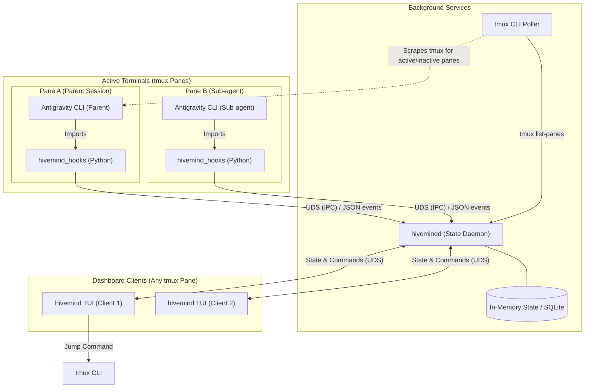

# `hivemind` - Architecture & Technical Design Document

This document outlines the system architecture, component design, data schemas, and communication protocols for **hivemind**, a tmux-native TUI dashboard. 

> [!NOTE]
> **Telemetry adapters are structured as plugins** to make the state daemon (`hivemindd`) generic and compatible with multiple developer tools. While MVP1 focuses primarily on the native Python Hook Adapter (`hivemind_hooks`) for the Google Antigravity (AGY) CLI, the pluggable architecture ensures seamless compatibility with other tools (such as Claude Code shims or other custom wrappers) in MVP2.

---

## 1. Architectural Overview

`hivemind` adopts a **client-daemon-adapter** architecture to ensure that state persists independently of any dashboard clients, multiple clients remain perfectly in sync, and telemetry ingestion remains decoupled from the UI.

### Component Diagram



### Component Breakdown

1. **State Daemon (`hivemindd`)**:
   - Runs as a lightweight, single-instance background daemon per machine.
   - Listens on a Unix Domain Socket (UDS) for incoming connections from both Hook Adapters (writing events) and TUI Clients (subscribing to state and writing commands).
   - Merges active telemetry events with periodic polling of `tmux` to detect exits, pane switches, and unmonitored sessions.

2. **Telemetry Hook Adapters (Plugins)**:
   - Structured as pluggable, tool-specific modules (e.g., the Python Hook Adapter `hivemind_hooks.py` for the Antigravity CLI, or future shims/wrappers for tools like Claude Code).
   - Any agent, wrapper, or developer tool can implement a telemetry plugin that communicates JSON lifecycle events to `hivemindd` via the standard Unix Domain Socket (UDS) protocol, ensuring compatibility with multiple platforms.
   - Designed to **fail silently and gracefully** (zero exceptions propagated) if the daemon or socket is unavailable, preserving 100% agent execution safety.

3. **TUI Dashboard Client (`hivemind`)**:
   - A keyboard-driven TUI that connects to the Daemon's UDS.
   - Receives the aggregated state tree and renders it in real-time.
   - Auto-spawns the Daemon in the background if it is not currently running.

---

## 2. Telemetry Event & State Schema

### 2.1. Telemetry Event Schema (Hook -> Daemon)
Every lifecycle hook publishes JSON messages conforming to this schema over the UDS:

```typescript
export interface HivemindEvent {
  eventId: string;
  sessionId: string;      // Unique Conversation ID for the Antigravity session
  timestamp: string;      // RFC3339 format
  eventType: 'session_started' | 'status_changed' | 'subagent_spawned' | 'subagent_status_changed' | 'session_stopped';
  
  context: {
    tmuxPaneId: string;   // e.g. "%12"
    tmuxSession: string;  // e.g. "hivemind"
    tmuxWindow: string;   // e.g. "1"
    cwd: string;          // Full path of working directory
    gitBranch?: string;   // Active git branch if applicable
  };

  payload: {
    status?: DerivedStatus;
    model?: string;       // e.g. "Gemini 3.5 Flash"
    
    // Sub-agent specific fields
    subagent?: {
      id: string;
      role: string;
      typeName: string;
      status: 'running' | 'completed' | 'errored';
    };

    // Event-specific metadata
    metadata?: Record<string, any>;
  };
}

export type DerivedStatus = 
  | 'idle' 
  | 'thinking' 
  | 'tool-running' 
  | 'awaiting-permission' 
  | 'awaiting-input' 
  | 'errored' 
  | 'no-telemetry';
```

---

## 3. Python Hook Adapter Design (`hivemind_hooks`)

The hook adapter uses the native `google.antigravity.hooks` framework to capture lifecycle transitions.

### 3.1. Telemetry Client Implementation

```python
# filepath: src/hooks/hivemind_hooks.py
import os
import sys
import json
import socket
import asyncio
import datetime
import subprocess
from typing import Optional, Any
from google.antigravity import types
from google.antigravity.hooks import hooks

SOCKET_PATH = os.path.expanduser("~/.config/hivemind/hivemind.sock")
FALLBACK_SOCKET_PATH = "/tmp/hivemind.sock"

class HivemindTelemetryClient:
    def __init__(self):
        self.session_id: Optional[str] = None
        self.tmux_pane_id = os.environ.get("TMUX_PANE", "")
        self.tmux_session = ""
        self.tmux_window = ""
        self.cwd = os.getcwd()
        self.git_branch = self._resolve_git_branch()
        self._resolve_tmux_coordinates()

    def _resolve_git_branch(self) -> Optional[str]:
        try:
            res = subprocess.run(["git", "branch", "--show-current"], capture_output=True, text=True, timeout=1)
            return res.stdout.strip() if res.returncode == 0 else None
        except Exception:
            return None

    def _resolve_tmux_coordinates(self):
        if not self.tmux_pane_id:
            return
        try:
            # Query tmux for current session and window index of this pane
            res = subprocess.run(
                ["tmux", "display-message", "-p", "-F", "#S #I", "-t", self.tmux_pane_id],
                capture_output=True, text=True, timeout=1
            )
            if res.returncode == 0:
                parts = res.stdout.strip().split()
                if len(parts) >= 2:
                    self.tmux_session = parts[0]
                    self.tmux_window = parts[1]
        except Exception:
            pass

    async def send_event(self, event_type: str, status: Optional[str] = None, payload: Optional[dict] = None):
        if not self.session_id:
            return

        event = {
            "type": "event",
            "eventId": f"evt_{os.urandom(8).hex()}",
            "sessionId": self.session_id,
            "timestamp": datetime.datetime.utcnow().isoformat() + "Z",
            "eventType": event_type,
            "context": {
                "tmuxPaneId": self.tmux_pane_id,
                "tmuxSession": self.tmux_session,
                "tmuxWindow": self.tmux_window,
                "cwd": self.cwd,
                "gitBranch": self.git_branch
            },
            "payload": {
                "status": status,
                **(payload or {})
            }
        }

        # Safe UDS write - must NEVER crash parent agent
        try:
            path = SOCKET_PATH if os.path.exists(os.path.dirname(SOCKET_PATH)) else FALLBACK_SOCKET_PATH
            reader, writer = await asyncio.open_unix_connection(path)
            writer.write(json.dumps(event).encode('utf-8') + b'\n')
            await writer.drain()
            writer.close()
            await writer.wait_closed()
        except Exception:
            # Silently degrade if socket or daemon is offline
            pass

# Singleton Client Instance
client = HivemindTelemetryClient()
```

### 3.2. AGY Lifecycle Hook Registrations

```python
# filepath: src/hooks/hivemind_hooks.py (continued)

@hooks.on_session_start
async def on_session_start(session_info: Any = None):
    # Retrieve or generate Conversation ID
    # In AGY SDK, the conversation ID is typically available on the context or generated here
    client.session_id = getattr(session_info, "conversation_id", f"session_{os.urandom(8).hex()}")
    await client.send_event("session_started", status="idle")

@hooks.on_session_end
async def on_session_end(session_info: Any = None):
    await client.send_event("session_stopped", status="idle")

@hooks.pre_turn
async def pre_turn(prompt: str) -> types.HookResult:
    await client.send_event("status_changed", status="thinking", payload={"prompt": prompt})
    return types.HookResult(allow=True)

@hooks.post_turn
async def post_turn(response: str):
    await client.send_event("status_changed", status="idle", payload={"response": response})

@hooks.pre_tool_call_decide
async def pre_tool(tool_call: types.ToolCall) -> types.HookResult:
    # 1. Check for interactive permission request tool
    if tool_call.name == "ask_permission":
        await client.send_event("status_changed", status="awaiting-permission", payload={
            "toolName": tool_call.args.get("Action"),
            "toolTarget": tool_call.args.get("Target"),
            "toolArgs": tool_call.args
        })
    # 2. Check for conversational user question
    elif tool_call.name == "ask_question":
        await client.send_event("status_changed", status="awaiting-input", payload={
            "question": tool_call.args.get("questions")
        })
    # 3. Default active tool running state
    else:
        await client.send_event("status_changed", status="tool-running", payload={
            "toolName": tool_call.name,
            "toolArgs": tool_call.args
        })
    
    return types.HookResult(allow=True)

@hooks.on_tool_error
async def on_tool_error(error: Exception):
    await client.send_event("status_changed", status="errored", payload={
        "errorType": type(error).__name__,
        "errorMessage": str(error)
    })
```

### 3.3. Hook Injection & Installation Mechanism

To satisfy the single-command setup requirement (**FR-7.3**), `hivemind` will automate the injection of the `hivemind_hooks` adapter into the user's active shell or Python path:

1. **Copy Adapter**: The `hivemind install-hooks` command copies `hivemind_hooks.py` to the global configuration directory: `~/.gemini/config/plugins/hivemind_hooks/`.
2. **Environment Bootstrap**: The installer appends the plugin path to the standard Python search path inside the user's active shell profile (e.g., `~/.zshrc`, `~/.bashrc`):
   ```bash
   # Added by hivemind installer
   export PYTHONPATH="$HOME/.gemini/config/plugins/hivemind_hooks:$PYTHONPATH"
   ```
3. **Dynamic Import on Agent Startup**:
   Inside the AGY configuration runner, if the telemetry hook is available in the Python path, the SDK hooks manager dynamically imports `hivemind_hooks` during agent boot-up:
   ```python
   # Inside global bootloader/config
   try:
       import hivemind_hooks
   except ImportError:
       pass
   ```
   This ensures that the hooks are loaded natively and start broadcasting automatically for all active sessions without requiring the user to edit their Python agent source files manually.

---

## 4. Sub-agent Integration Workflow

In the Google Antigravity SDK, multi-agent orchestration is natively managed using the standard tool-calling interface (e.g., calling `invoke_subagent`).

```python
# filepath: src/hooks/hivemind_hooks.py (continued)

@hooks.pre_tool_call_decide
async def pre_tool_subagent_check(tool_call: types.ToolCall) -> types.HookResult:
    # Intercept subagent spawning
    if tool_call.name == "invoke_subagent":
        subagents = tool_call.args.get("Subagents", [])
        for sa in subagents:
            await client.send_event("subagent_spawned", payload={
                "subagent": {
                    "id": f"sub_{os.urandom(6).hex()}", # Replaced with actual ID if exposed
                    "role": sa.get("Role", "Subagent"),
                    "typeName": sa.get("TypeName", "self"),
                    "status": "running"
                }
            })
    return types.HookResult(allow=True)
```

---

## 5. Bidirectional Commands (Forward-Compatible MVP2)

Because UDS represents a full-duplex socket, MVP2 bidirectional actions can be handled gracefully inside the synchronous `pre_tool_call_decide` hook.

```python
# Future MVP2 Concept
@hooks.pre_tool_call_decide
async def pre_tool_decide_bidirectional(tool_call: types.ToolCall) -> types.HookResult:
    if tool_call.name == "ask_permission":
        # Stream the block event to the daemon
        await client.send_event("status_changed", status="awaiting-permission", ...)
        
        # Keep socket open and await manual command response from UDS
        decision = await client.await_remote_decision(tool_call)
        return types.HookResult(allow=decision == "allow")
```

---

## 6. Project Technology Stack

| Component | Technology | Rationale |
|---|---|---|
| **Daemon & CLI** | **Go (Golang)** | Generates a single, lightweight binary containing both the CLI (`hivemind`) and the daemon (`hivemindd`). Native, fast UDS support, clean concurrency primitives (goroutines/channels) for managing multi-client event broadcasting, and zero external dependency for end-users. |
| **TUI Rendering** | **Bubble Tea (Go)** | The industry standard for beautiful, state-driven, highly testable terminal UIs. Features excellent keyboard navigation, viewport controls, and tree rendering capabilities. |
| **Telemetry Adapters (Plugins)** | **Extensible JSON/UDS Protocol** | Pluggable, decoupled architecture. Supports the Python-based `hivemind_hooks` (via AGY SDK hooks) for the Antigravity CLI, as well as separate shims or adapters for external tools like Claude Code. |

---

## 7. Testing & Verification Architecture

To ensure high reliability across components, languages, and runtime configurations, `hivemind` implements a multi-tiered automated testing architecture:

### 7.1. Unit Testing (Go Daemon)
The core state transition logic, active pane tmux synchronization, and subscriber broadcasting mechanisms are covered by automated unit tests in `pkg/daemon/server_test.go`:
* **`TestEventProcessing`**: Asserts that sending lifecycle state packets updates the in-memory tree representation correctly.
* **`TestTmuxSyncAndPruning`**: Mocks the tmux pane CLI poller output to verify pane exit handling and cool-off pruning.
* **`TestMultiClientBroadcasting`**: Runs the UDS server using a temporary socket and verifies that multiple concurrent clients subscribe and receive broadcasts simultaneously.

### 7.2. End-to-End Integration Testing (`cmd/hivemind/integration_test.go`)
An in-depth, cross-language integration test suite is implemented in Go to prove that all tools are working together correctly. The execution flow is as follows:

1. **Compilation**: The test compiles the current `cmd/hivemind/main.go` source code into a temporary `hivemind` executable to test actual build logic.
2. **Spawning the Daemon**: Spawns the compiled binary in `daemon` mode with an isolated socket path `/tmp/hivemind_integration.sock`.
3. **Simulating a Subscriber Client**: Dials the test socket and subscribes to state tree broadcasts.
4. **Streaming Telemetry Events**: Executes the Python mock emitter (`src/hooks/mock_emitter.py`) in client mode targeting the test socket path. The emitter sends a complete lifecycle sequence (session started -> thinking -> running tool -> spawn subagent -> complete subagent -> session stopped).
5. **Real-time Assertions**: The client subscriber reads the JSON broadcasts and asserts that the state changes propagate instantly across process boundaries. It verifies:
   - Dynamic creation of tmux sessions.
   - Status changes (`idle`, `thinking`, `tool-running`).
   - Spawned child subagents and their lifecycles.
6. **Graceful Teardown**: Automatically kills all spawned child processes and removes the temporary socket file upon completion.

