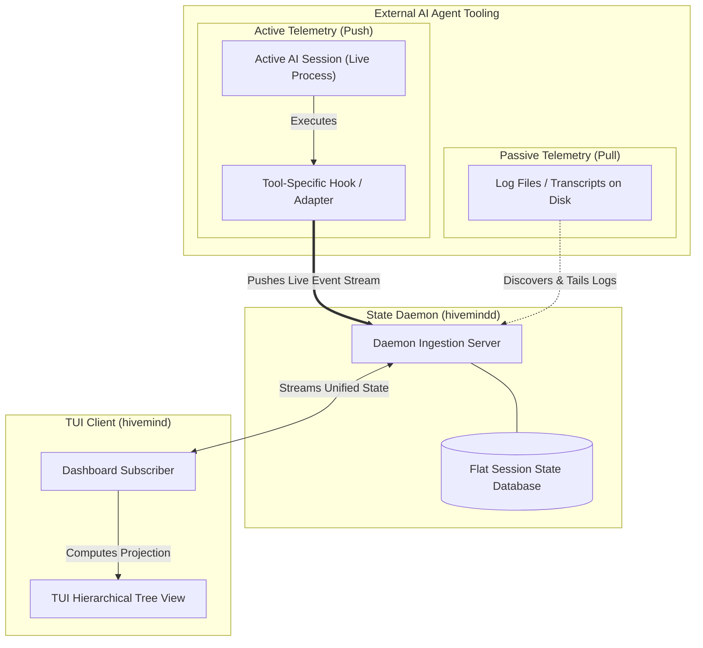
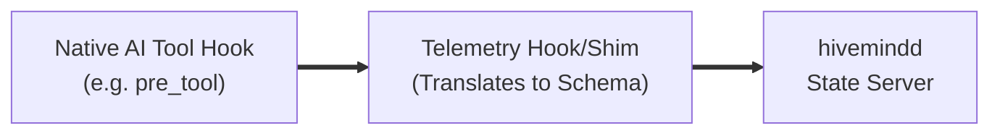
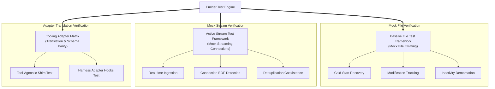

# `hivemind` - Architecture & Technical Design Document

This document outlines the system architecture, component design, data schemas, and communication protocols for **hivemind**, a terminal-native TUI dashboard for monitoring AI agent swarms.

> [!NOTE]
> **Telemetry adapters are structured as pluggable, tool-agnostic extensions** to make the state daemon (`hivemindd`) generic and compatible with multiple developer tools. While reference implementations are provided for specific developer tool clients, the pluggable, protocol-agnostic architecture ensures seamless compatibility with any arbitrary agent wrapper.
>
> **Language Standard**: To ensure performance, clean multi-transport compilation, and seamless concurrency management, all telemetry adapter plugins and daemon extensions **MUST be implemented in Golang**, unless bound by specific client runtime constraints (such as SDK client hooks in other languages).

---

## 1. Architectural Overview

`hivemind` adopts a decoupled **client-daemon-adapter** architecture to ensure that agent state persists independently of any dashboard clients, multiple UI panels remain perfectly in sync, and telemetry ingestion remains decoupled from rendering.

### Component Diagram



### Discovery & Telemetry Mechanisms

The daemon utilizes two primary architectural mechanisms to discover running AI coding sessions and know exactly what is going on inside them:

1. **Active Telemetry (Push-Based Hooks)**:
   * **Session Discovery**: When a developer initiates an AI session in any terminal pane, a tool-specific lifecycle hook executes. This hook establishes a communication channel to the daemon and transmits a `session_started` lifecycle event. The channel may be configured as a persistent stream or run as a series of short-lived socket connections, depending on the tool's environment and runtime constraints.
   * **State Tracking**: As the agent works, the hook pushes real-time telemetry packets (e.g. status changes, tool calls, and sub-agent spawns) to the daemon. The daemon tracks session activity using either the persistence of the live connection or event-driven inactivity timeouts (cooldowns) for short-lived connections.


2. **Passive Telemetry (Pull-Based Log Discovery & Tailing)**:
   * **Session Discovery**: The daemon periodically scans designated runtime or configurations folders on disk to discover active agent transcripts or session state files.
   * **State Tracking**: Upon discovering a log file, the daemon tails and parses its contents to reconstruct the session's turn-by-turn history. It maps the session's active/inactive lifecycle directly to the filesystem's last-modified timestamps.

---

## 2. Telemetry Event & State Representation

### 2.1. Telemetry Event Representation (Adapter -> Daemon)
Every telemetry adapter publishes standard event payloads over the communication channel conforming to this JSON structure:

```json
{
  "eventId": "evt_ab48f29e",
  "sessionId": "8d0f3530-e791-48f9-b2c0-eac6af12ed12",
  "timestamp": "2026-06-01T14:41:28Z",
  "eventType": "status_changed",
  "context": {
    "tmuxPaneId": "%12",
    "tmuxSession": "hivemind",
    "tmuxWindow": "1",
    "cwd": "/Users/jacobmiller22/projects/hivemind",
    "gitBranch": "main"
  },
  "payload": {
    "status": "thinking",
    "model": "Gemini 3.5 Flash",
    "metadata": {}
  }
}
```

### 2.2. Session State Representation (Daemon Storage)
The daemon maintains a single flat database of logical Session records. There is no hierarchy in storage; sessions are identified solely by their unique `sessionId`. 

To keep the daemon lightweight and agnostic, it does not manage complex lifecycle state flags or storage schemas. Instead, it stores raw metadata and maintains a single `lastActivity` datetime. 

A Session record consists of:
* **Session ID**: A logical unique identifier (e.g., Conversation ID).
* **Derived Status**: The current status derived from telemetry events (`idle`, `thinking`, `tool-running`, `awaiting-permission`, `awaiting-input`, `errored`, `no-telemetry`).
* **Model**: The model currently in use.
* **Last Activity**: An RFC3339 timestamp recording when the most recent telemetry event or log modification occurred. The TUI client uses this timestamp to determine whether a session is active/inactive and to calculate elapsed duration since inactivity.
* **Metadata Context**: Tmux coordinates (`tmuxPaneId`, `tmuxSession`, `tmuxWindow`), the current working directory (`cwd`), and `gitBranch`.
* **Sub-agent Registry**: A key-value map of child sub-agents spawned by the parent session (containing `id`, `role`, `typeName`, `status`, `spawnedAt`, and `completedAt`).

### 2.3. View Projections (Client Rendering)
The TUI client subscribes to this flat `SessionState` list. It separates data modeling from user interface presentation:
* **Tmux Projection**: Groups flat sessions by their `tmuxSession` and `tmuxWindow` metadata tags to render the primary tree layout. If location metadata is absent, it projects the session under an `"unmonitored"` category.
* **Alternative Projections (MVP2)**: Because storage is flat, the TUI can instantly reorganize the UI into a **Project Directory Tree** (grouping by `cwd`) or a **Priority Attention List** (sorting by `awaiting-permission` and `errored` status first) entirely on the client side.

---

## 3. Hook Adapters & Plugin Architecture

`hivemind` provides a pluggable telemetry model designed to support varied developer tools. 

### 3.1. Telemetry Flow
Active adapters intercept native tool lifecycles and translate them into standard `hivemind` JSON events. 



Adapters are decoupled from the state daemon and the transport protocol:
1. **Tool-Agnostic Translation**: Adapters shield the daemon from specific CLI hook naming conventions. The adapter translates the tool's internal hooks (such as tool permissions, thinking states, or user questions) into the standard `status_changed` event.
2. **Safe Communication**: Adapters implement non-blocking connection routines and must fail silently if the daemon server is not running, ensuring that telemetry monitoring never blocks or crashes the developer's agent execution.

---

## 4. Sub-agent Integration Workflow

Multi-agent swarms (e.g., sub-agents spawned via tools like `invoke_subagent` or sub-processes) are mapped as child elements under their parent logical `Session` record:
* **Spawning**: When the parent agent initiates a sub-agent execution, the telemetry adapter sends a `subagent_spawned` event containing the child's `id`, `role`, and `typeName`.
* **State Updates**: Updates to sub-agents (`running`, `completed`, `errored`) are sent via `subagent_status_changed` events.
* **Staleness Tracking**: When a sub-agent transitions to a completed or errored state, the completion timestamp is recorded. The elapsed duration since completion is tracked, enabling the client interface to handle cool-offs and visibility thresholds.

---

## 5. Bidirectional Commands (Forward-Compatible MVP2)

Active Telemetry Channels are designed to accommodate full-duplex or request-response pipelines. Although MVP1 primarily utilizes unidirectional event streaming (agent to daemon), the protocol natively supports forward-compatible bidirectional command exchange:
* **Interactive Prompts**: When a live session enters `awaiting-permission` status, the event context contains detailed tool call metadata.
* **Remote Action**: In MVP2, the daemon can stream approval or denial commands back to the telemetry adapter. Depending on the adapter design, this is supported either over a long-lived persistent streaming channel or via request-response handshakes on connection-per-event setups, where the adapter can block on socket reads or poll for decisions.

---

## 6. Project Technology Stack

| Component | Technology | Rationale |
|---|---|---|
| **Daemon & CLI** | **Go (Golang)** | Generates a single, lightweight binary containing both the CLI (`hivemind`) and the daemon (`hivemindd`). Native socket/IPC support, clean concurrency primitives (goroutines/channels) for managing multi-client subscription broadcasts, and zero external dependency for end-users. |
| **TUI Rendering** | **Bubble Tea (Go)** | The industry standard for beautiful, state-driven, highly testable terminal UIs. Features excellent keyboard navigation, viewport controls, and tree rendering capabilities. |
| **Telemetry Adapters (Plugins)** | **Language-Standard Protocol** | Pluggable, decoupled architecture. Extensible standard JSON event exchange. All adapters are written in Go unless strictly runtime-constrained by the client tool SDK. |

---

## 7. Testing & Verification Architecture

To ensure high reliability across varied environments, transports, and developer tools, `hivemind` implements a language-agnostic, multi-transport testing architecture.



### 7.1. Passive File Test Framework (Mock File Emitting)
This suite verifies the daemon's passive file poller and filesystem-driven state lifecycle:
* **Cold-Start Recovery**: Asserts that placing a pre-populated transcript or JSON file into the monitored session directory correctly recovers the logical session state tree.
* **Modification Tracking**: Simulates active user prompts by making sequential writes to the mock transcript files and asserting that the session status and timestamps update in the daemon.
* **Inactivity Demarcation**: Asserts that when the mock file is left untouched beyond the configured window (e.g. 5 minutes), the daemon updates the session's `lastActivity` timestamp based on the file's last-modified timestamp, and the client or daemon tracks inactivity correctly without prematurely pruning the record from the state tree.

### 7.2. Active Stream Test Framework (Mock Streaming Connections)
This suite verifies real-time event-driven ingestion and channel-based process lifecycle tracking:
* **Real-time Event Ingestion**: Launches a mock active telemetry client that dials the daemon's communication channel and sends status events. Asserts that derived status transitions propagate to the state tree with sub-second latency.
* **Inactivity & EOF Detection**: Asserts that when a persistent stream connection is closed abruptly (EOF), or when short-lived connections cease sending events beyond a threshold, the daemon updates the `lastActivity` timestamp and handles appropriate session cool-off tracking.
* **Deduplication Coexistence**: Connects both a mock active stream client and places a mock passive transcript file under the same `SessionID`. Asserts that the live active stream takes absolute priority, merging the location coordinates from the live stream and suppressing/pruning the passive duplicate record.

### 7.3. Tooling Adapter Matrix (Translation & Schema Parity)
This suite verifies tool-specific integration, ensuring various developer tool adapters translate their native hooks into correct `hivemind` schemas:
* **Tool-Agnostic Shim Test**: Pipes mock wrapper outputs from active tools through shims. Asserts that the shims normalize these commands into the standard JSON schema with correct `DerivedStatus` transitions.
* **Harness Adapter Hooks Test**: Runs a test harness that mocks standard SDK telemetry life cycles (session start, pre/post turns, and tool décider triggers). Asserts that the hook adapter translates the structures cleanly and transmits them over the communication channel with zero exceptions.
