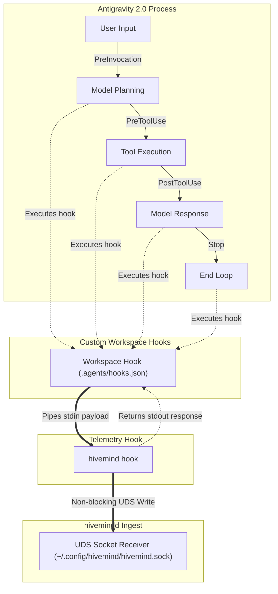
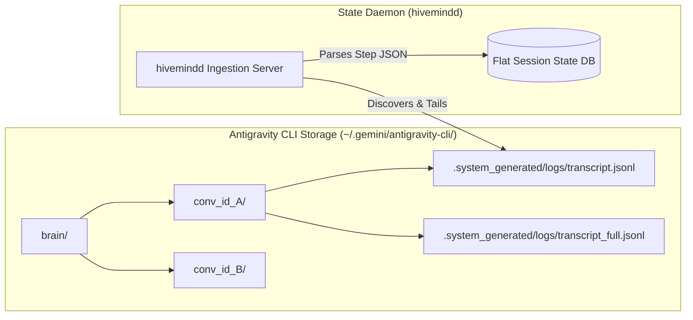

# Antigravity Integration Guide

This document explores the architectural design, compatibility, and integration paths for connecting the **Antigravity** family of AI developer tools with the **hivemind** monitoring daemon (`hivemindd`).

> [!NOTE]
> **Integration Philosophy**: To keep `hivemindd` generic and extensible, integrations with tools like Antigravity are structured as pluggable telemetry shims or log-parsing adapters. These adapters map native tool lifecycles onto standard Hivemind events (`session_started`, `status_changed`, etc.) without altering the core daemon architecture.

---

## 1. Architectural Compatibility Summary

The Antigravity product suite comprises three distinct products. Because each product operates on a different runtime environment and interface paradigm, their compatibility with `hivemind` varies. 

### Compatibility & Integration Matrix

| Product | Architecture Paradigm | Active Telemetry (Push) | Passive Telemetry (Pull/Logs) | Integration Strategy |
| :--- | :--- | :--- | :--- | :--- |
| **Antigravity CLI** | Terminal-native AI coding agent | **Unsupported / Unknown** (No middleware/hook hooks exposed) | **Fully Supported** (Watching local transcript session files) | Active monitoring via log discovery and tailing of local session databases. |
| **Antigravity 2.0 Agent Manager** | GUI dashboard & orchestrator | **Fully Supported** (Process-based `hooks.json` configs) | **Supported** (Tailing local session transcript files) | Active push-based telemetry forwarding events using the `hivemind` binary hook command. |
| **Antigravity IDE** | Desktop IDE integration environment | **Not Compatible** | **Not Compatible** | **No Integration Planned** |

---

## 2. Active Telemetry: Push-Based Hooks (Antigravity 2.0)

Antigravity 2.0 supports process-based hooks that execute local shell commands or scripts during its execution loop. Hooks are configured in a `hooks.json` file placed in the `.agents/` customization folder in the active workspace. These hooks communicate via JSON payload over standard input (stdin) and receive gating/action decisions over standard output (stdout).

### 2.1. Telemetry Hook Flow

The compiled Go binary `hivemind` acts directly as the hook executable (using the subcommand `hivemind hook <event>`). It intercepts these events, forwards the normalized state payload to the `hivemindd` UNIX domain socket, and immediately releases control back to the agent process:



### 2.2. Event Mapping Schema

Based on active telemetry recorded in `/tmp/antigravity_hook_debug.log`, the following hook events map directly to Hivemind session states:

| Hook Event | Trigger Point | Stdin Payload Excerpt | Derived State Transition |
| :--- | :--- | :--- | :--- |
| **`PreInvocation`** | Before calling the model. | `{"invocationNum": 3, "initialNumSteps": 10, "conversationId": "..."}` | Transition session status to `thinking`. |
| **`PreToolUse`** | Before executing a tool. | `{"toolCall": {"name": "run_command", "args": {...}}, "stepIdx": 19, "conversationId": "..."}` | Transition status to `tool-running`. Map tool call name & args to the event payload. (Transition to `awaiting-permission` if `name` is `ask_permission`). |
| **`PostToolUse`** | After a tool call completes. | `{"stepIdx": 5, "error": "exit status 1", "conversationId": "..."}` | Transition to `thinking` (or `errored` if `error` is present). |
| **`Stop`** | When the execution loop terminates. | `{"terminationReason": "model_stop", "fullyIdle": true, "conversationId": "..."}` | Transition status to `idle` (or `session_stopped` if `fullyIdle` is `true`). |

---

## 3. Passive Telemetry: Pull-Based Log Discovery

For Antigravity CLI, **Passive Telemetry (Pull-Based)** is the primary and highly deterministic integration pathway. The CLI automatically persists comprehensive, step-by-step logs and conversation transcripts to the local filesystem.



### 3.1. Transcript Location & Structure

* **Base Configuration Directory**: `~/.gemini/antigravity-cli/`
* **Session Directory Path**: `~/.gemini/antigravity-cli/brain/<conversation-id>/.system_generated/logs/`
* **Target Transcript Files**:
  * `transcript.jsonl`: Contains the chronological list of user inputs, tool invocations, and planner responses.
  * `transcript_full.jsonl`: Full detailed log containing complete tool payloads and execution steps.

### 3.2. Log Format Specification

The transcript files are structured in JSON Lines (JSONL) format. Each line represents a discrete state transition or step in the AI session lifecycle.

#### Example Event Entry (User Input)
```json
{
  "step_index": 0,
  "source": "USER_EXPLICIT",
  "type": "USER_INPUT",
  "status": "DONE",
  "created_at": "2026-06-01T15:59:46Z",
  "content": "<USER_REQUEST>\nhello\n</USER_REQUEST>"
}
```

#### Example Event Entry (Planner Tool Execution Request)
```json
{
  "step_index": 2,
  "source": "MODEL",
  "type": "PLANNER_RESPONSE",
  "status": "DONE",
  "created_at": "2026-06-01T15:59:46Z",
  "content": "I can help you analyze the workspace directory...",
  "tool_calls": [
    {
      "name": "list_dir",
      "args": {
        "DirectoryPath": "\"/Users/jacobmiller22/projects/hivemind\"",
        "toolAction": "\"/Listing the root workspace directory\"",
        "toolSummary": "\"/Workspace listing\""
      }
    }
  ]
}
```

---

## 4. State Parsing & Recovery Heuristics

A specialized `AntigravityPassiveAdapter` can tail and parse these JSONL transcripts to seamlessly project active sessions onto the Hivemind dashboard.

### 4.1. Lifecycle Mapping Rules

To determine the `DerivedStatus` of an Antigravity CLI session, the adapter tracks the latest parsed line in the active `transcript.jsonl`:

| Last Line `type` / Condition | Last Line `status` | Derived Status | Explanation |
| :--- | :--- | :--- | :--- |
| `USER_INPUT` | `DONE` | `thinking` | The user submitted a prompt; the agent is currently planning. |
| `PLANNER_RESPONSE` (contains `tool_calls`) | `DONE` | `tool-running` | The agent decided to execute a tool. |
| `PLANNER_RESPONSE` (no `tool_calls`) | `DONE` | `idle` | The agent completed its response turn and is waiting for user input. |
| Any step | `ERROR` | `errored` | The process encountered an unhandled system failure. |

### 4.2. Context Extraction

* **Session Identity**: Mapped directly from the parent folder's `<conversation-id>` UUID in the path `brain/<conversation-id>`.
* **CWD (Current Working Directory)**: Extracted by examining file path arguments in recent tool calls (e.g., `list_dir` or `view_file`) or parsing early command execution contexts.
* **Last Activity**: Determined using the `created_at` timestamp of the latest event inside `transcript.jsonl` or the last-modified metadata of the log file itself.

---

## 5. Integration Feasibility Matrix

The table below highlights how specific Antigravity CLI behaviors map to the state representation requirements of `hivemind`:

| Antigravity CLI Feature | Integration Feasibility | Design Strategy |
| :--- | :--- | :--- |
| **Interactive Tool Calls** | **Highly Feasible** | The passive adapter flags transitions to `tool-running` based on `PLANNER_RESPONSE` containing `tool_calls`. |
| **Subagent Management** | **Feasible** | When subagents are spawned (documented via specific tool invocations in the transcript), the adapter registers them in the session's Sub-agent Registry. |
| **Active Telemetry Hook** | **Not Feasible** | Currently blocked by lack of native extension hooks in the CLI. |

---

## 6. Implementation Roadmap

To officially support Antigravity CLI in the Hivemind ecosystem:

1. **Add `AntigravityPassiveAdapter` to `hivemindd`**:
   * Implement directory polling for `~/.gemini/antigravity-cli/brain/`.
   * Parse `transcript.jsonl` files in real-time as updates are written by the CLI process.
2. **Implement State Coexistence / Recovery**:
   * Map discovered directories to logical Session records.
   * Project status changes onto the terminal TUI dynamically using last-modified timestamps.
3. **Verify via Passive File Test Framework**:
   * Verify that cold-starting the daemon correctly recovers past sessions under the correct conversation IDs.
   * Assert that new steps written to the logs dynamically update the session's state and `lastActivity` fields.
