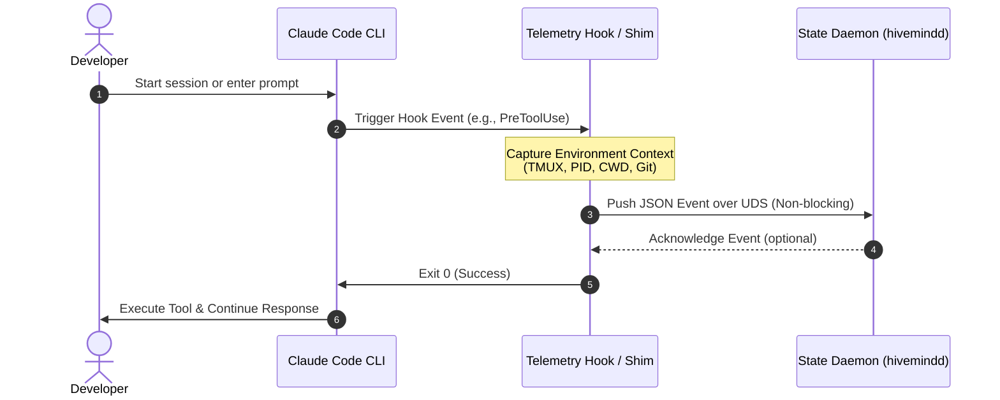
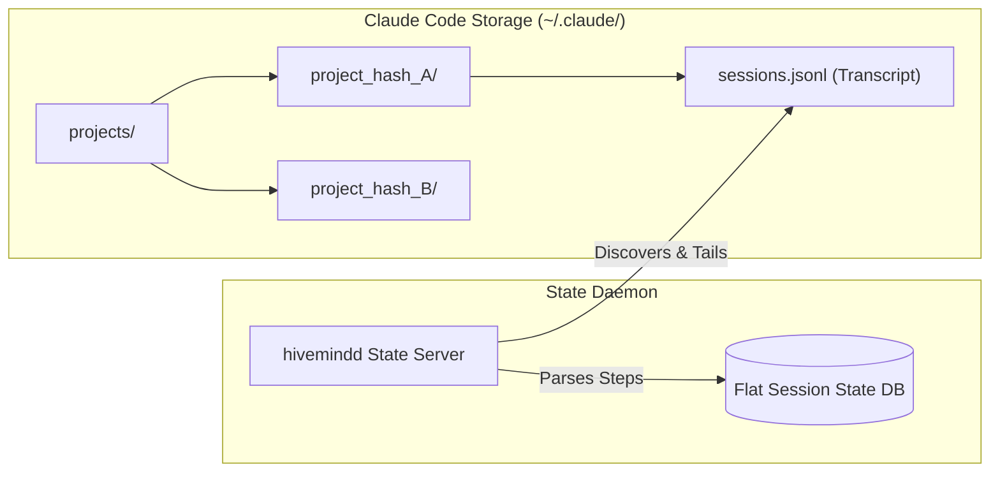
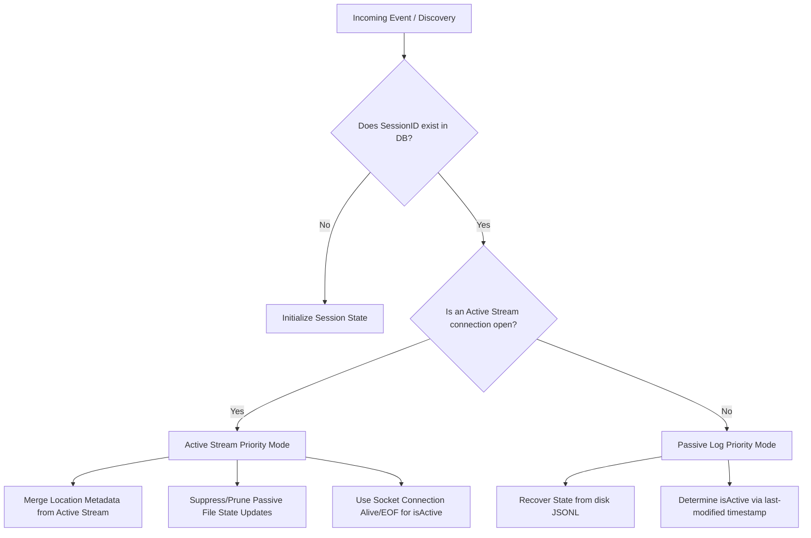

# Claude Code Integration Guide

This document explores the architectural design, compatibility, and integration paths for connecting **Claude Code** (Anthropic's terminal-native AI coding agent) with the **hivemind** monitoring daemon (`hivemindd`).

> [!NOTE]
> **Integration Philosophy**: To keep `hivemindd` generic and extensible, integrations with tools like Claude Code are structured as pluggable telemetry shims that map native tool lifecycles onto standard Hivemind events (`session_started`, `status_changed`, etc.) without altering the core daemon architecture.

---

## 1. Architectural Compatibility Summary

Claude Code is highly compatible with the `hivemind` dual-telemetry design. It supports both **Active (Push-Based)** and **Passive (Pull-Based)** integration methods, each offering unique trade-offs in terms of latency, telemetry coverage, and configuration overhead.

| Capability | Active Telemetry (Push-Based Hooks) | Passive Telemetry (Pull-Based Logs) |
| :--- | :--- | :--- |
| **Integration Status** | **Fully Supported** via custom hook shims | **Supported** via log directory tailing |
| **Latency** | Sub-second (real-time UDS pushes) | 1–2 seconds (file system polling) |
| **Setup Overhead** | Requires configuring `.claude/settings.json` | Zero-config (daemon automatically scans disk) |
| **Session Association** | Direct (hook inherits PID, tmux pane/window context) | Inferred (requires parsing path hashes/heuristics) |
| **Reliability** | Fail-silent socket connections required | High (reads persisted transcripts asynchronously) |

---

## 2. Active Telemetry: Push-Based Hooks

Claude Code provides a robust, native **hooks middleware** system that allows deterministic execution of external scripts at key points in its life cycle. By mapping these life-cycle hooks to a custom lightweight Go or Bash shim, Claude Code can stream live telemetry directly to the `hivemindd` Unix Domain Socket (UDS).

### Telemetry Pipeline



### 2.1. Supported Hooks Mapping

Claude Code exposes four critical lifecycle hooks. We map these to `hivemind`'s standard `DerivedStatus` states:

1. **`UserPromptSubmit`**:
   * **Trigger**: Triggered immediately when the user submits a new prompt before Claude begins planning.
   * **State Mapping**: Transitions daemon session to `thinking`.
2. **`PreToolUse`**:
   * **Trigger**: Executed before a specific tool (e.g., `bash`, `view_file`) is run.
   * **State Mapping**: Transitions daemon session to `tool-running` or `awaiting-permission` (if manual approval is required).
3. **`PostToolUse`**:
   * **Trigger**: Executed immediately after a tool finishes execution.
   * **State Mapping**: Transitions daemon session back to `thinking`.
4. **`Stop`**:
   * **Trigger**: Executed when Claude finishes its current response turn and awaits further user input.
   * **State Mapping**: Transitions daemon session to `idle`.

### 2.2. Configuration Setup

To enable active telemetry, register the hook shims in the global (`~/.claude/settings.json`) or project-level (`.claude/settings.json`) configuration:

```json
{
  "hooks": {
    "UserPromptSubmit": "/usr/local/bin/hivemind-hook --event prompt_submit",
    "PreToolUse": "/usr/local/bin/hivemind-hook --event pre_tool",
    "PostToolUse": "/usr/local/bin/hivemind-hook --event post_tool",
    "Stop": "/usr/local/bin/hivemind-hook --event stop"
  }
}
```

> [!IMPORTANT]
> **Non-Blocking / Fail-Silent Execution**:
> Custom hooks in Claude Code run **synchronously** and block execution. If the hook hangs or crashes, it pauses or halts Claude.
> The `hivemind-hook` shim **must** implement a strict non-blocking connection routine:
> * Establish UDS connection with a microsecond-level timeout (e.g., 50ms).
> * Fail silently and exit with status code `0` if `hivemindd` is not running.
> * Never exit with non-zero status codes unless explicitly intending to block execution.

---

## 3. Passive Telemetry: Pull-Based Log Discovery

For a zero-configuration developer experience, `hivemindd` can tail the local log and session files managed automatically by Claude Code on disk.



### 3.1. Transcript Location & Format

* **Paths**:
  * Global/Default: `~/.claude/`
  * Project-Specific Sessions: `~/.claude/projects/` (where subfolders are named based on project path hashing).
* **Format**: Standard JSONL files containing chronologically indexed session events, including user prompts, planner responses, tool invocations, and tool results.

### 3.2. Integration & State Recovery Heuristics

A `ClaudeCodePassiveAdapter` can be introduced to `hivemindd`'s file-polling module:

1. **Discovery**: The adapter polls `~/.claude/projects/` for any modified JSONL log files.
2. **Context Reconstruction**:
   * **Session ID**: Mapped directly from the subfolder hash or session log name.
   * **CWD Extraction**: Extracted by traversing the transcript for early filesystem/bash commands, or reading metadata within the session log.
   * **Tmux Location**: If launched inside a tmux window, passive logs won't inherently contain tmux coordinates. `hivemindd` will project the session under the `"unmonitored"` category unless location metadata is annotated.
3. **State Parsing**:
   * Reads the final lines of the active transcript to determine status:
     * Last line `USER_INPUT` $\rightarrow$ `thinking`.
     * Last line `TOOL_CALL` without completed result $\rightarrow$ `tool-running`.
     * Last line finished $\rightarrow$ `idle`.

## 4. Telemetry Responsibility, Overlap, & Deduplication Strategy

To maintain a consistent and single source of truth for Claude Code sessions without UI flickering, state thrashing, or double-counting, the `hivemind` daemon implements a strict separation of concerns, overlap definitions, and a state merge/deduplication strategy.

### 4.1. Event Responsibility Matrix

Each telemetry mechanism is responsible for distinct aspects of the session state:

| State Attribute / Event | Active Telemetry (Push-Based Hooks) | Passive Telemetry (Pull-Based Logs) |
| :--- | :--- | :--- |
| **`session_started` / Discovery** | **Primary**: Triggered instantly by the initial user prompt submission. | **Secondary**: Discovered during periodic file system polling. |
| **`status_changed` (Real-time)** | **Primary**: Instantaneous transitions (`thinking` $\rightarrow$ `tool-running` $\rightarrow$ `idle`). | **Backup**: Infers status from the latest appended JSONL lines. |
| **Tmux & Terminal Coordinates** | **Exclusive**: Captures exact environment variables (`$TMUX_PANE`, `$PID`, `$PWD`). | **None**: No inherent environment info exists inside logs. |
| **Multi-Agent / Sub-agent Registry** | **Partial**: Captures when a hook registers child process invocation. | **Primary**: Traverses step-by-step history to catalog all subagents spawned. |
| **Turn History / Transcript** | **None**: Does not stream entire turn contents over the socket. | **Exclusive**: Parses and aggregates full historical turns and execution logs. |
| **`session_stopped` / EOF** | **Primary**: Instantaneous via UDS connection closure (EOF detection). | **Backup**: Triggered by log modification idle timeout. |

### 4.2. Telemetry Overlap & Conflict Risks

Because both adapters monitor the exact same session (referenced by a shared `SessionID` mapped from the project path/session ID), several conflict risks exist:
* **State Thrashing (Out-of-Order Events)**: File system writes by Claude Code can be buffered or batch-flushed by the operating system, causing passive polling to receive old state updates *after* the active hook has already pushed a newer state.
* **Status Divergence**: Passive log parsers might calculate a different derived status heuristic (e.g. interpreting a slow-running command as `idle`) than the explicit, deterministic state pushed by active hooks.
* **Duplicate Sessions**: If the daemon registers the passive file discovery under `"file:<SessionID>"` and the active socket stream under the raw `<SessionID>`, it would render two duplicate rows in the TUI client.

### 4.3. Unified Deduplication (Coexistence) Strategy

To reconcile conflicts and achieve seamless coexistence, `hivemindd` enforces a **Connection-Prioritized Merge** strategy.



#### Deduplication Rules

1. **Active Stream Priority**:
   * If `hivemindd` has an established, open UDS socket connection for a `SessionID`, it enters **Active Stream Priority Mode**.
   * While this connection is active, all passive file-polling updates for the same `SessionID` are **completely suppressed** or discarded for state transitions (e.g. status, active flags). This eliminates OS-buffered disk write thrashing.
2. **Metadata Merging & Identity Coexistence**:
   * The passive log poller reads from files under `~/.claude/projects/` and registers the session. If the active hook connects, the daemon identifies the common logical `SessionID`.
   * It collapses them into a single record, merging the terminal metadata (Tmux pane/window, shell PID) from the active stream into the rich history and transcript structure recovered from the passive disk file.
3. **Graceful Handoff**:
   * When Claude Code exits or the tmux pane is closed, the active UDS connection closes. The daemon instantly detects the `EOF` (Connection EOF Detection) and marks `isActive: false`.
   * The daemon then transitions the session to **Passive Log Priority Mode**. It performs a final sync against the disk-persisted transcript to capture any trailing log writes and starts tracking the session's inactivity duration based on the file's last-modified timestamp.

---

## 5. Integration Feasibility Matrix

The table below highlights how specific advanced features of Claude Code map to the current capabilities of `hivemind`:

| Claude Code Feature | Integration Feasibility | Design Strategy |
| :--- | :--- | :--- |
| **Interactive Permission Prompts** | **Highly Feasible** | When Claude Code blocks for tool permissions, `PreToolUse` publishes `awaiting-permission` status to the daemon, including the tool name and command details. |
| **MCP (Model Context Protocol) Servers** | **Feasible** | `hivemind` can expose its own MCP server to Claude Code, letting Claude query dashboard state or register subagents natively via structured tool calls. |
| **Multi-Agent / Sub-agent Spawning** | **Moderately Feasible** | Claude Code does not spawn independent subagents out-of-the-box, but calls external scripts/tools. If these external tools are wrapped with the Hivemind SDK, they are registered as child processes. |
| **Remote Interdiction (Kill/Approve)** | **Future Goal (MVP2)** | Using full-duplex UDS channels, a blocking `PreToolUse` hook can wait for remote TUI approval/rejection commands before exiting. |

---

## 6. Implementation Roadmap

To officially support Claude Code in the Hivemind ecosystem:

1. **Implement `hivemind-hook` Shim**:
   * Write a lightweight Go/Bash utility compiled alongside the core CLI.
   * Standardize UDS packet formatting matching the `HivemindEvent` schema.
2. **Add `ClaudePassiveAdapter` to `hivemindd`**:
   * Implement directory polling for `~/.claude/projects/`.
   * Create a JSONL parser specialized in mapping Claude's internal turn structures to the standard status schema.
3. **Document Hook Setup in TUI**:
   * Display configuration instructions within the Hivemind dashboard when no sessions are actively monitored.
